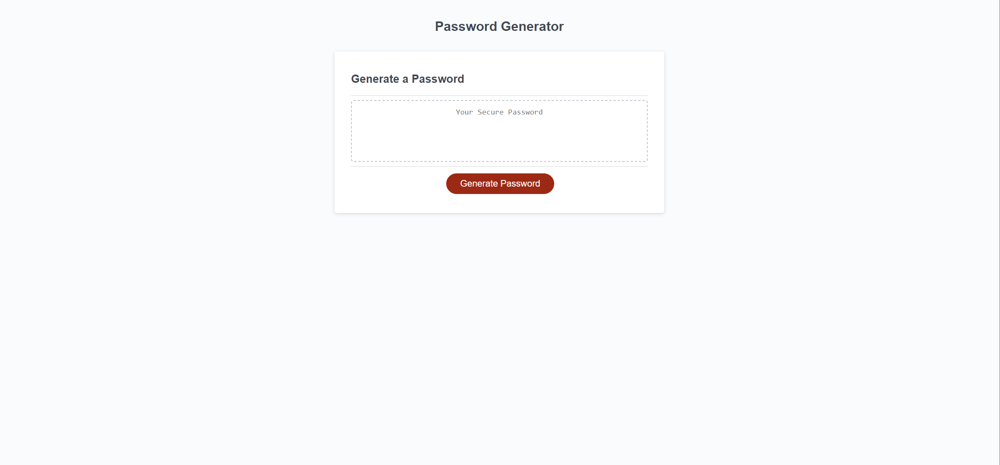

# Random Password Generator

## Description

The purpose of this Random Password Generator is to give users a mew password they can use to secure any account. Users can specify parameters for the generator to adhere to when creating the new password. Passwords can contain any number of characters from 8 up to 128 and can use uppercase letters, lowercase letters, numbers, and/or special characters depending the user's preferences.

The live site can be accessed by clicking [here!](https://prich57.github.io/password-generator/)

## Installation

N/A

## Usage

To use this Random Password Generator, click on the button that says "Generate a Password". A prompt will appear at the top of the browser window asking the user to type in a desired number of characters between, and including, 8 and 128. Upon receiving an invalid input, an alert will tell the user their input was invalid and prompt them to try again. 

After receiving a valid input, a series of new prompts will appear asking if the user would like to include uppercase letters, lowercase letters, numbers, and/or special characters in their password. If the user selects "OK" for any prompt, then that character type will be included in the password. However, if the user selects "Cancel" for each prompt an alert will appear informing the user they have not selected any character types and it will run through the list of prompts continuously until at least one character type has been selected.

After the user has provided valid input for the character type prompts, a confirmation will appear verifying the parameters they selected are what they want to include in their new randomly generated password. If the user selects "OK" their password will generate. If the user selects "Cancel" the process will be cancelled and they will have to click the "Generate Password" button again.

## Mock-Up

The following image shows the web application's design and functionality.

## Credits

The starter code for this project was provided in the coursework for the University of Denver's Coding Boot Camp.

## License

N/A